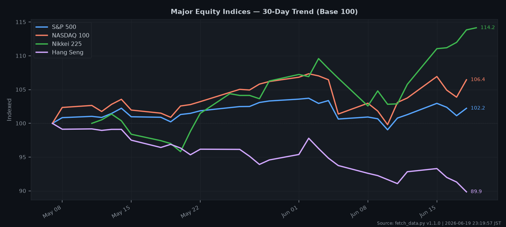
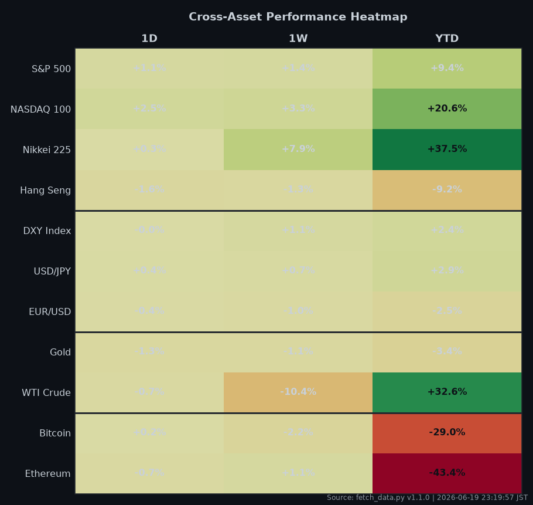

# 📊 Daily Economic Intelligence Report

A two-stage Python pipeline that fetches live macro & market data and produces a
polished **daily PDF report** — market dashboard, trend charts, an auto-generated
narrative, a forward economic calendar, and data-driven key takeaways.

All timestamps are in **JST (Asia/Tokyo)**.

---

## ✨ Features

- **Multi-source data** — FRED (US/intl rates, CPI, GDP), Yahoo Finance (indices,
  FX, commodities, crypto), and the World Bank (cross-country inflation & GDP).
- **Three charts** — 30-day equity trend (normalized), US rates & yield curve, and
  a cross-asset performance heatmap.
- **Auto narrative & key takeaways** — risk regime, yield-curve signal, biggest
  movers, and cross-asset signals derived from the data (no LLM required).
- **Forward calendar** — upcoming high-impact US releases (CPI, NFP, GDP, PCE…)
  pulled from FRED's release schedule.
- **Data-quality scoring** — every series is checked for errors and freshness;
  the report carries an overall **High / Medium / Low** confidence rating.
- **Self-documenting outputs** — Markdown + print-ready PDF, plus raw JSON and run logs.

---

## 🖼️ Sample Output

| Equity 30-Day Trend | Cross-Asset Heatmap |
|---|---|
|  |  |

> Full example report: [`reports/econ-insight_2026-06-19.pdf`](reports/econ-insight_2026-06-19.pdf)

---

## 🏗️ How It Works

```
                ┌────────────────┐        ┌──────────────────┐
  FRED ───┐     │                │        │                  │
  Yahoo ──┼──►  │  fetch_data.py │  ───►  │ render_report.py │  ───►  PDF + Markdown
  WorldBk ┘     │  (acquisition) │  JSON  │  (presentation)  │        + 3 charts
                └────────────────┘        └──────────────────┘
```

1. **`fetch_data.py`** → pulls all indicators, computes baselines (1D / 1W / YTD / 1Y),
   validates quality, and writes `data/raw_YYYY-MM-DD.json` (+ a state snapshot for deltas).
2. **`render_report.py`** → reads that JSON and renders the charts, Markdown, and PDF
   into `charts/` and `reports/`.

---

## 🚀 Setup

Requires **Python 3.11+** (tested on 3.14).

```bash
# 1. Create & activate a virtual environment
python -m venv .venv
# Windows:
.venv\Scripts\activate
# macOS/Linux:
source .venv/bin/activate

# 2. Install dependencies
pip install -r requirements.txt

# 3. Configure your FRED API key (free)
cp .env.example .env
#   then edit .env and paste your key
```

Get a free FRED API key (≈2 min): https://fred.stlouisfed.org/docs/api/api_key.html

---

## ▶️ Usage

```bash
# Step 1 — fetch today's data
python fetch_data.py

# Step 2 — render the report
python render_report.py

# (optional) render a specific day's JSON
python render_report.py data/raw_2026-06-15.json
```

Open the result at `reports/econ-insight_YYYY-MM-DD.pdf`.

---

## 📁 Output Structure

| Path | Contents | Tracked in git? |
|---|---|---|
| `data/raw_*.json` | Raw fetched data + quality flags | ✗ (git-ignored) |
| `data/state_latest.json` | Snapshot for next-day deltas | ✗ |
| `logs/errors_*.txt` | Per-run log | ✗ |
| `charts/*.png` | The 3 generated charts | ✓ (samples) |
| `reports/econ-insight_*.{md,pdf}` | Final report | ✓ (samples) |

---

## 📄 Report Sections

1. **Executive Summary** — top 3 headlines
2. **Key Indicators Dashboard** — values, 1D/YTD changes, source
3. **Market Narrative** — risk regime + auto-written commentary
4. **Chart Analysis** — each chart with "What it shows / Key Observations / Watch for"
5. **Forward Calendar** — upcoming US releases (next 14 days)
6. **Data Confidence & Limitations** — quality flags
7. **Key Takeaways** — what matters today

---

## 🧰 Tech Stack

`pandas` · `matplotlib` · `reportlab` · `yfinance` · `fredapi` · `requests` ·
`python-dotenv` · `Pillow` · `pytz`

---

## 🐛 Troubleshooting

- **All Yahoo tickers fail / `YFRateLimitError` / `'str' object has no attribute 'name'`**
  → Use **`yfinance >= 1.4.1`** (it bundles `curl_cffi` and impersonates a browser
  internally). Do **not** pass a custom `session=` to `yf.download`.
- **Calendar (Section 5) empty** → make sure `FRED_API_KEY` is set in `.env`. Major
  monthly releases can legitimately be weeks out.
- **`UnicodeEncodeError` on Windows (cp932)** → handled by forcing UTF-8 stdout; if you
  fork the scripts, keep that shim.

See [`CHANGELOG.md`](CHANGELOG.md) for the full fix history.

---

## ⚠️ Disclaimer

This project is for **informational and educational purposes only. Not financial advice.**
