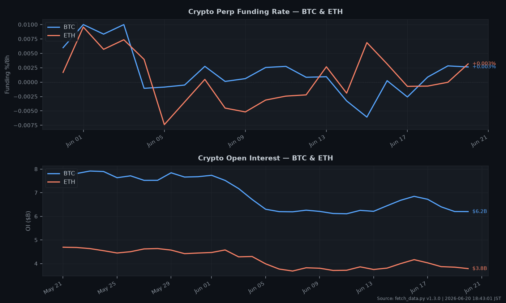
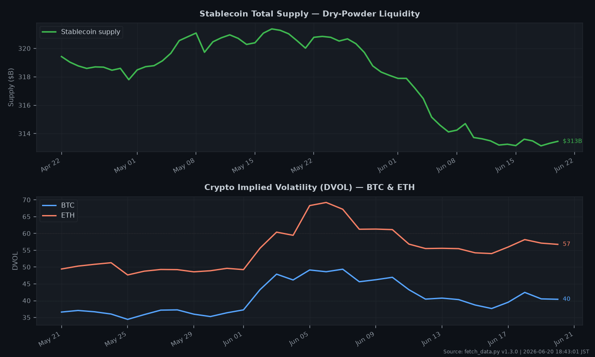

# 📊 Daily Economic Intelligence Report

A two-stage Python pipeline that fetches live macro **and crypto-native** market data
and produces a polished **daily PDF report** — market dashboard, trend charts, an
auto-generated narrative, a forward economic calendar, and data-driven key takeaways.

Built for daily macro context **plus crypto swing-trading signals** (derivatives
positioning, liquidity, implied volatility). All timestamps are in **JST (Asia/Tokyo)**.

---

## ✨ Features

- **Multi-source data** — FRED (US/intl rates, CPI, GDP, real yield), Yahoo Finance
  (indices, FX, commodities, BTC/ETH spot), the World Bank (cross-country inflation &
  GDP), and a **crypto-native quant layer** (Binance, Bybit, Deribit, DeFiLlama, CoinGecko).
- **Crypto quant signals** — perp **funding rate** (Binance + Bybit cross-check),
  **open interest**, **long/short ratio**, **DVOL** implied volatility, total
  **stablecoin supply** (liquidity), and **BTC dominance** / ETH-BTC ratio.
- **Five charts** — (1) 30-day equity trend, (2) US rates & yield curve, (3) cross-asset
  performance heatmap, (4) crypto funding & open interest, (5) crypto liquidity & volatility.
- **Auto narrative & key takeaways** — risk regime (S&P + market breadth), yield-curve
  signal, biggest movers, cross-asset signals, and a **Crypto Market Structure** read
  (funding crowding, leverage, stablecoin liquidity) — all data-driven, no LLM required.
- **Forward calendar** — upcoming high-impact US releases (CPI, NFP, GDP, PCE…) from
  FRED's release schedule.
- **Data-quality scoring** — every series is checked for errors and freshness
  (cadence-aware, incl. intraday crypto); the report carries an overall
  **High / Medium / Low** confidence rating.
- **Self-documenting outputs** — Markdown + print-ready PDF, plus raw JSON and run logs.

---

## 🖼️ Sample Output

| Equity 30-Day Trend | Cross-Asset Heatmap |
|---|---|
|  |  |

| Crypto Funding & Open Interest | Crypto Liquidity & Volatility |
|---|---|
|  |  |

> Full example report: [`reports/econ-insight_2026-06-20.pdf`](reports/econ-insight_2026-06-20.pdf)

---

## 🏗️ How It Works

```
   FRED ─────┐     ┌────────────────┐        ┌──────────────────┐
   Yahoo ────┤     │                │        │                  │
   Crypto ───┼──►  │  fetch_data.py │  ───►  │ render_report.py │  ──►  PDF + Markdown
   WorldBank ┘     │  (acquisition) │  JSON  │  (presentation)  │       + 5 charts
                   └────────────────┘        └──────────────────┘
```

1. **`fetch_data.py`** → pulls all indicators, computes baselines (1D / 1W / YTD / 1Y,
   plus 30D for short-history crypto series), validates quality, and writes
   `data/raw_YYYY-MM-DD.json` (+ a state snapshot for deltas).
2. **`render_report.py`** → reads that JSON and renders the 5 charts, Markdown, and PDF
   into `charts/` and `reports/`.

---

## 🔌 Data Sources

| Source | Provides | Key needed |
|---|---|---|
| **FRED** | US/intl rates, CPI, GDP, 10Y real yield, release calendar | Free key (required) |
| **Yahoo Finance** | Equity indices, FX, commodities, BTC/ETH spot | No |
| **World Bank** | Cross-country GDP growth & inflation (annual) | No |
| **Binance Futures** | Funding rate, open interest, long/short ratio | No |
| **Bybit** | Funding rate (cross-check) | No |
| **Deribit** | DVOL implied-volatility index (BTC/ETH) | No |
| **DeFiLlama** | Total stablecoin supply (liquidity proxy) | No |
| **CoinGecko** | BTC dominance, ETH/BTC ratio | Optional (works keyless) |

---

## 🚀 Setup

Requires **Python 3.11+** (tested on 3.14).

```bash
# 1. Create & activate a virtual environment
python -m venv .venv
# Windows:
.venv\Scripts\activate
# macOS/Linux:
source .venv/bin/activate

# 2. Install dependencies
pip install -r requirements.txt

# 3. Configure your API keys
cp .env.example .env
#   then edit .env — FRED_API_KEY is required; COINGECKO_API_KEY is optional
```

- Free FRED API key (≈2 min): https://fred.stlouisfed.org/docs/api/api_key.html
- Optional CoinGecko Demo key (higher rate limits; the `/global` endpoint also works
  without one): https://www.coingecko.com/en/api/pricing

---

## ▶️ Usage

```bash
# Step 1 — fetch today's data
python fetch_data.py

# Step 2 — render the report
python render_report.py

# (optional) render a specific day's JSON
python render_report.py data/raw_2026-06-20.json
```

Open the result at `reports/econ-insight_YYYY-MM-DD.pdf`.

---

## 📁 Output Structure

| Path | Contents | Tracked in git? |
|---|---|---|
| `data/raw_*.json` | Raw fetched data (incl. `crypto_data`) + quality flags | ✗ (git-ignored) |
| `data/state_latest.json` | Snapshot for next-day deltas | ✗ |
| `logs/errors_*.txt` | Per-run log | ✗ |
| `charts/*.png` | The 5 generated charts | ✓ (samples) |
| `reports/econ-insight_*.{md,pdf}` | Final report | ✓ (samples) |

---

## 📄 Report Sections

1. **Executive Summary** — top 3 headlines
2. **Key Indicators Dashboard** — values, 1D/YTD changes, source (macro + crypto rows)
3. **Market Narrative** — risk regime + macro commentary + **Crypto Market Structure**
4. **Chart Analysis** — all 5 charts with "What it shows / Key Observations / Watch for"
5. **Forward Calendar** — upcoming US releases (next 14 days)
6. **Data Confidence & Limitations** — quality flags
7. **Key Takeaways** — what matters today

---

## 🧰 Tech Stack

`pandas` · `matplotlib` · `reportlab` · `yfinance` · `fredapi` · `requests` ·
`curl_cffi` · `python-dotenv` · `Pillow` · `pytz`

---

## 🐛 Troubleshooting

- **All Yahoo tickers fail / `YFRateLimitError` / `'str' object has no attribute 'name'`**
  → Use **`yfinance >= 1.4.1`** (it bundles `curl_cffi` and impersonates a browser
  internally). Do **not** pass a custom `session=` to `yf.download`.
- **Crypto layer empty** → the public crypto endpoints are unauthenticated but can be
  geo-restricted (notably Binance in some regions); each source degrades gracefully and
  a failure shows up as an error flag in Section 6 rather than crashing the run.
- **Calendar (Section 5) empty** → make sure `FRED_API_KEY` is set in `.env`. Major
  monthly releases can legitimately be weeks out.
- **`UnicodeEncodeError` on Windows (cp932)** → handled by forcing UTF-8 stdout; if you
  fork the scripts, keep that shim.

See [`CHANGELOG.md`](CHANGELOG.md) for the full fix history.

---

## ⚠️ Disclaimer

This project is for **informational and educational purposes only. Not financial advice.**
